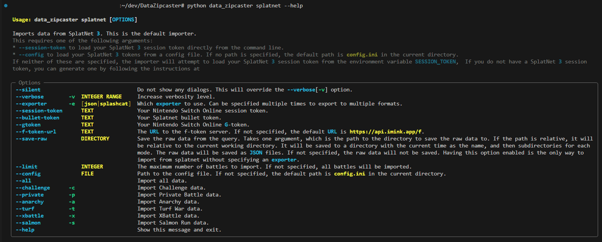

Data Zipcaster
==============

Named after the [Zipcaster](https://splatoonwiki.org/wiki/Zipcaster) special from Splatoon 3, Data Zipcaster serves as a versatile data transportation platform focused on enabling seamless data interchange between Splatoon 3 related projects and the official SplatNet 3 service.

Data Zipcaster boasts a robust Command Line Interface (CLI), crafted with Python and supported across Windows, macOS, and Linux platforms. With the CLI, users can easily access and utilize the extensive features of the platform. Moreover, the CLI is conveniently available as a Python package for integration into other Python projects, aiming for the utmost ease-of-use.

Screenshots
-----------

Clear and descriptive help messages!

Beautiful, helpful error messages!

Progress bars for long-running tasks!

Installation
------------

Data Zipcaster currently requires Python and Git. After cloning the repository, simply use `python data_zipcaster` to start the application. We are working on easier installation methods which will include an executable file, PyPI package, and Docker image. If you are interested in other installation methods, please open an issue on our Github page.

Usage
-----

To get started, use `python data_zipcaster --help` for general help. For specific functionality, try `python data_zipcaster splatnet --help`. For more information on the CLI, refer to the `cli` folder which contains a README with detailed information.

Integration as Python Package
-----------------------------

Data Zipcaster uses a MVC pattern, with the CLI completely independent from the models, views, and transforms. This makes it easy to build upon the platform and integrate it into other projects. To extend the CLI with additional importers and exporters, refer to the `splatnet` importer and `splashcat` exporter as guides.

Error Handling
--------------

The CLI employs `rich` for intuitive error handling, including beautiful error messages and descriptive text for most common errors. Unsolvable errors are logged to `errors.txt` with instructions on how to report them.

Automatic Updater
-----------------

Our automatic updater is currently under development and will be available as part of the first release. Sorry for the inconvenience!

Contributing
------------

Contributions are welcome! Please refer to our upcoming contribution guide for detailed instructions.

License
-------

Data Zipcaster is licensed under GNU GPLv3. For more information, please refer to the `LICENSE` file.

Support
-------

For support or to report issues, please open an issue on our Github page or add us on Discord at `pyproject.toml`.

For the latest updates or changes to the project, please refer to the repo, although this may change in the future.

Stay tuned for screenshots and diagrams that will help users better understand our project and its usage!
